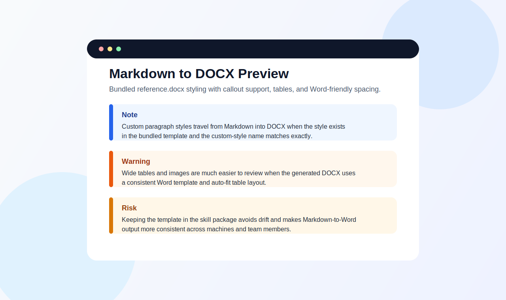

# Markdown to DOCX

`markdown-to-docx` is a small wrapper repo around Pandoc for turning Markdown files into Microsoft Word documents.

It does not replace Pandoc. Instead, it packages a reusable Word style template, cross-platform helper scripts, and one small post-processing fix for Word table layout.

## Run The Showcase Example

If you want the fastest way to see the repo working, run the included showcase sample from the repo root:

macOS/Linux:

```bash
./scripts/pandoc_md_to_docx.sh samples/showcase.md
```

Windows:

```powershell
.\scripts\pandoc_md_to_docx.ps1 -InputPath .\samples\showcase.md
```

This writes `samples/showcase.docx`.

## Preview

Here is a stylized preview of the kind of Word output the bundled template is aiming for:



## Use As A Codex Skill

This repo now also ships a self-contained Codex skill at `skills/markdown-to-docx`.

What the skill helps with:

- converting local Markdown files to DOCX with the bundled scripts
- customizing the bundled Word reference template
- fixing or expanding `custom-style` callout support for Word output

Install it from GitHub with the skill-installer helper:

```bash
python3 ~/.codex/skills/.system/skill-installer/scripts/install-skill-from-github.py --repo ourarash/markdown-docx-tool --path skills/markdown-to-docx
```

Restart Codex after installation so the new skill is loaded.

If you want to run the installed skill files directly, use the bundled Python launcher so you do not depend on shell executable bits being preserved during installation:

macOS/Linux:

```bash
python3 ~/.codex/skills/markdown-to-docx/scripts/markdown_to_docx.py path/to/file.md
```

Windows:

```powershell
py -3 ~\.codex\skills\markdown-to-docx\scripts\markdown_to_docx.py .\path\to\file.md
```

Example prompts for Codex:

- `Convert ./samples/showcase.md to a Word document using the markdown-to-docx skill.`
- `Make a DOCX version of ./samples/meeting-notes.md and put it in ./output/meeting-notes.docx.`
- `Update the markdown-to-docx template so Note and Warning callouts stand out more in Word.`
- `Add a new custom-style callout to the markdown-to-docx reference template.`

Local dependencies still required:

- `pandoc` on every platform
- `perl`, `zip`, and `unzip` on macOS/Linux
- Python when you want to use the installed skill launcher directly

## What This Adds

- `📝` a reusable Word reference template in `skills/markdown-to-docx/scripts/reference.docx`
- `🖥️` helper scripts for macOS/Linux and Windows
- `📎` predictable handling for relative input paths and linked assets
- `📊` one DOCX XML fix so wide tables auto-fit better in Word
- `🧠` a GitHub-installable Codex skill in `skills/markdown-to-docx`

If you already prefer running Pandoc directly and do not need these defaults, you may not need this repo.

## What's Included

It ships with:

- a self-contained Codex skill: `skills/markdown-to-docx/`
- repo-root compatibility wrappers: `scripts/pandoc_md_to_docx.sh` and `scripts/pandoc_md_to_docx.ps1`
- a cross-platform Python launcher: `skills/markdown-to-docx/scripts/markdown_to_docx.py`
- a bundled Word reference template: `skills/markdown-to-docx/scripts/reference.docx`
- sample Markdown files under `samples/`

The conversion flow stays intentionally close to Pandoc and keeps one post-processing step that switches Word tables from fixed layout to auto-fit, which helps wide Markdown tables render more naturally. The repo-root scripts are compatibility wrappers that delegate into the skill-local implementation.

## Repo Layout

```text
markdown-to-docx/
├── README.md
├── skills/
│   └── markdown-to-docx/
│       ├── SKILL.md
│       ├── references/
│       └── scripts/
│           ├── markdown_to_docx.py
│           ├── pandoc_md_to_docx.ps1
│           ├── pandoc_md_to_docx.sh
│           └── reference.docx
├── assets/
│   └── showcase-preview.svg
├── .github/
│   └── workflows/
│       └── ci.yml
├── scripts/
│   ├── pandoc_md_to_docx.ps1
│   ├── pandoc_md_to_docx.sh
│   ├── validate_reference_docx.py
│   └── verify_installed_skill.py
└── samples/
    ├── meeting-notes.md
    └── showcase.md
```

## Install On macOS

1. Install Pandoc.

   ```bash
   brew install pandoc
   ```

2. Make sure the helper tools are available.

   macOS usually already includes `bash`, `perl`, `zip`, and `unzip`. You can verify with:

   ```bash
   bash --version
   perl -v
   zip -v
   unzip -v
   ```

3. Make the shell script executable.

   ```bash
   chmod +x scripts/pandoc_md_to_docx.sh
   chmod +x skills/markdown-to-docx/scripts/pandoc_md_to_docx.sh
   ```

4. Run a sample conversion from the repo root.

   ```bash
   ./scripts/pandoc_md_to_docx.sh samples/showcase.md
   ```

   That writes `samples/showcase.docx`.

5. Optional: write the output somewhere else.

   ```bash
   ./scripts/pandoc_md_to_docx.sh samples/showcase.md output/showcase.docx
   ```

## Install On Windows

1. Install Pandoc and confirm it is on your `PATH`.

   In PowerShell:

   ```powershell
   pandoc --version
   ```

2. Open PowerShell in the repo root.

3. If your system blocks local scripts, allow this session to run them.

   ```powershell
   Set-ExecutionPolicy -Scope Process Bypass
   ```

4. Run a sample conversion.

   ```powershell
   .\scripts\pandoc_md_to_docx.ps1 -InputPath .\samples\showcase.md
   ```

   That writes `samples\showcase.docx`.

5. Optional: write the output somewhere else.

   ```powershell
   .\scripts\pandoc_md_to_docx.ps1 -InputPath .\samples\showcase.md -OutputPath .\output\showcase.docx
   ```

## How To Use It

From the repo root, point either script at a Markdown file:

macOS/Linux:

```bash
./scripts/pandoc_md_to_docx.sh path/to/file.md
./scripts/pandoc_md_to_docx.sh path/to/file.md path/to/output.docx
```

Windows:

```powershell
.\scripts\pandoc_md_to_docx.ps1 -InputPath .\path\to\file.md
.\scripts\pandoc_md_to_docx.ps1 -InputPath .\path\to\file.md -OutputPath .\path\to\output.docx
```

Advanced examples:

macOS/Linux:

```bash
./scripts/pandoc_md_to_docx.sh --toc --output-dir output samples/showcase.md
./scripts/pandoc_md_to_docx.sh --metadata-file metadata.yaml samples/meeting-notes.md
./scripts/pandoc_md_to_docx.sh --reference-doc custom/reference.docx samples/showcase.md output/custom-showcase.docx
```

Windows:

```powershell
.\scripts\pandoc_md_to_docx.ps1 -InputPath .\samples\showcase.md -OutputDir .\output -TableOfContents
.\scripts\pandoc_md_to_docx.ps1 -InputPath .\samples\meeting-notes.md -MetadataFile .\metadata.yaml
.\scripts\pandoc_md_to_docx.ps1 -InputPath .\samples\showcase.md -ReferenceDoc .\custom\reference.docx -OutputPath .\output\custom-showcase.docx
```

Behavior:

- The input file can be absolute, repo-relative, or relative to your current working directory.
- If you do not pass an output path, the script writes a `.docx` file next to the Markdown file.
- `--output-dir` keeps the default filename but writes it to a different directory.
- `--toc` adds a table of contents through Pandoc.
- `--metadata-file` passes a Pandoc metadata file through to the conversion.
- `--reference-doc` lets you override the bundled Word template.
- Relative images are resolved from the input file's directory.
- Styling comes from `skills/markdown-to-docx/scripts/reference.docx`.
- The scripts apply one DOCX XML fix after Pandoc runs so Word tables auto-fit better.

## Customizing The Word Style

Edit `skills/markdown-to-docx/scripts/reference.docx` in Microsoft Word when you want to change:

- heading styles
- normal paragraph spacing
- code block appearance
- table styling
- fonts

Keep the filename the same so the scripts can continue to find it automatically.

## Sample Markdown

Use the included files to see what the converter handles well:

- `samples/showcase.md` demonstrates headings, emphasis, lists, tables, quotes, footnotes, fenced code blocks, and `custom-style` callout sections such as `Note`, `Tip`, `Important`, `Warning`, `Risk`, and `Caution`.
- `samples/meeting-notes.md` is a smaller real-world example for notes and action items.

Try them directly:

macOS/Linux:

```bash
./scripts/pandoc_md_to_docx.sh samples/showcase.md
./scripts/pandoc_md_to_docx.sh samples/meeting-notes.md output/meeting-notes.docx
```

Windows:

```powershell
.\scripts\pandoc_md_to_docx.ps1 -InputPath .\samples\showcase.md
.\scripts\pandoc_md_to_docx.ps1 -InputPath .\samples\meeting-notes.md -OutputPath .\output\meeting-notes.docx
```

## Troubleshooting

- If `pandoc` is not found, install it first and reopen your terminal.
- If the shell script says a command is missing on macOS, install the missing tool and rerun the conversion.
- If PowerShell blocks script execution, rerun `Set-ExecutionPolicy -Scope Process Bypass` in that terminal window.
- If a Markdown file references images, keep the image paths relative to the Markdown file or use absolute paths.

## Development Checks

Validate the bundled Word template styles:

```bash
python3 scripts/validate_reference_docx.py --list --skill-doc skills/markdown-to-docx/SKILL.md --callout-doc skills/markdown-to-docx/references/callout-styles.md
```

Verify the skill after installing it into a temporary Codex-style directory:

```bash
python3 scripts/verify_installed_skill.py --output /tmp/installed-skill-showcase.docx
```

## License

MIT
