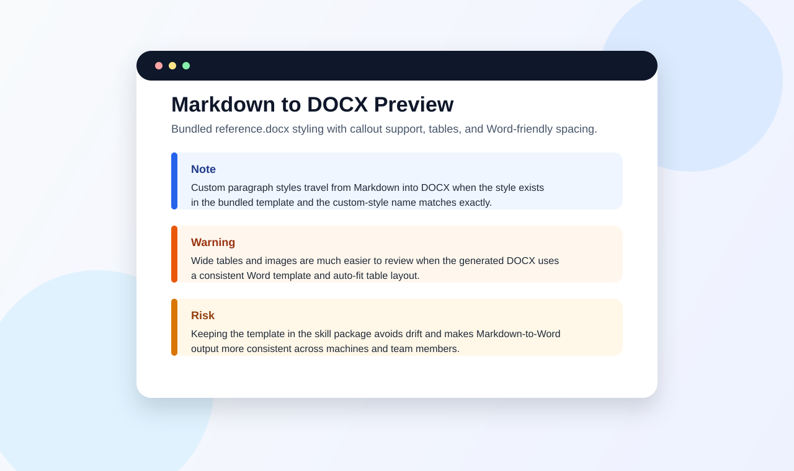
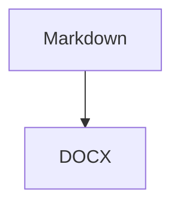

# Markdown to DOCX

[](https://github.com/ourarash/markdown-docx-tool/actions/workflows/ci.yml)
[](https://github.com/ourarash/markdown-docx-tool/blob/main/LICENSE)

`markdown-to-docx` is a small Pandoc wrapper for turning Markdown files into Microsoft Word documents with a bundled `reference.docx`, cross-platform helper scripts, and one post-processing fix so wide tables auto-fit better in Word.

## Preview



## Quick Start

Requirements:

- `pandoc` on every platform
- `perl`, `zip`, and `unzip` on macOS/Linux
- `mmdc` from `@mermaid-js/mermaid-cli` if you want Mermaid diagrams rendered into DOCX
- Python only if you want to use the installed skill launcher directly

Run a sample conversion from the repo root:

macOS/Linux:

```bash
./scripts/pandoc_md_to_docx.sh samples/showcase.md
```

Windows:

```powershell
.\scripts\pandoc_md_to_docx.ps1 -InputPath .\samples\showcase.md
```

This writes `samples/showcase.docx`.

Useful options:

- `--toc` / `-TableOfContents` adds a table of contents
- `--metadata-file` / `-MetadataFile` passes Pandoc metadata
- `--reference-doc` / `-ReferenceDoc` overrides the bundled template
- `--output-dir` / `-OutputDir` keeps the default filename but writes elsewhere

Examples:

macOS/Linux:

```bash
./scripts/pandoc_md_to_docx.sh path/to/file.md
./scripts/pandoc_md_to_docx.sh --toc --output-dir output samples/showcase.md
```

Windows:

```powershell
.\scripts\pandoc_md_to_docx.ps1 -InputPath .\path\to\file.md
.\scripts\pandoc_md_to_docx.ps1 -InputPath .\samples\showcase.md -OutputDir .\output -TableOfContents
```

## Mermaid Diagrams

If your Markdown includes fenced Mermaid blocks such as:

````markdown

```mermaid
flowchart TD
  A[Markdown] --> B[DOCX]
```
````

the wrappers now render them into image files before Pandoc writes the DOCX. Install Mermaid CLI first.

macOS:

```bash
brew install mermaid-cli
```

or:

```bash
npm install -g @mermaid-js/mermaid-cli
```

Windows PowerShell:

```powershell
npm install -g @mermaid-js/mermaid-cli
```

Mermaid CLI also needs a browser runtime. If `mmdc` reports that Chrome or `chrome-headless-shell` is missing, install that runtime before converting Mermaid diagrams. One common option is:

```bash
npx puppeteer browsers install chrome-headless-shell
```

If you are running in a sandboxed or locked-down environment and Chrome needs extra launch flags, point the converter at a Puppeteer config file.

By default the tool emits PNG diagrams into `<output>_media/mermaid/`, centers them in Word, and adds automatic captions such as `Figure 1. Flowchart`. You can tune the renderer with environment variables:

- Mermaid diagrams are centered by default in DOCX output
- `MARKDOWN_DOCX_MERMAID_FORMAT=png` or `svg`
- `MARKDOWN_DOCX_MERMAID_SCALE=2` to increase PNG resolution
- `MARKDOWN_DOCX_MERMAID_WIDTH=5.5in` to set the default embedded width in DOCX
- `MERMAID_MMDC=/absolute/path/to/mmdc` if the executable is not on `PATH`
- `MARKDOWN_DOCX_MERMAID_PUPPETEER_CONFIG=/path/to/puppeteer.json` if Chrome needs extra launch args such as `--no-sandbox`

You can also size an individual Mermaid block directly in Markdown with Pandoc attributes:

````markdown
```{.mermaid width=4.75in}
flowchart TD
  A[Draft] --> B[Review]
```
````

See `samples/mermaid.md` for a ready-to-convert example.

## Codex Skill

This repo also ships a self-contained Codex skill at `skills/markdown-to-docx`.

Install it from GitHub:

```bash
python3 ~/.codex/skills/.system/skill-installer/scripts/install-skill-from-github.py --repo ourarash/markdown-docx-tool --path skills/markdown-to-docx
```

Then use the bundled Python launcher:

macOS/Linux:

```bash
python3 ~/.codex/skills/markdown-to-docx/scripts/markdown_to_docx.py path/to/file.md
```

Windows:

```powershell
py -3 ~\.codex\skills\markdown-to-docx\scripts\markdown_to_docx.py .\path\to\file.md
```

Example prompts:

- `Convert ./samples/showcase.md to a Word document using the markdown-to-docx skill.`
- `Make a DOCX version of ./samples/meeting-notes.md and put it in ./output/meeting-notes.docx.`
- `Update the markdown-to-docx template so Note and Warning callouts stand out more in Word.`

## Template Customization

Edit `skills/markdown-to-docx/scripts/reference.docx` in Microsoft Word to change headings, paragraph spacing, code blocks, table styling, or fonts. Keep the filename the same so the scripts continue to find it automatically.

The sample files under `samples/` are good starting points for testing template changes:

- `samples/showcase.md` covers headings, lists, tables, code blocks, footnotes, and callout styles
- `samples/meeting-notes.md` is a smaller notes-style example
- `samples/mermaid.md` shows Mermaid diagrams being rendered as images for DOCX output

## Development Checks

Validate the bundled Word template styles:

```bash
python3 scripts/validate_reference_docx.py --list --skill-doc skills/markdown-to-docx/SKILL.md --callout-doc skills/markdown-to-docx/references/callout-styles.md
```

Verify the skill after installing it into a temporary Codex-style directory:

```bash
python3 scripts/verify_installed_skill.py --output /tmp/installed-skill-showcase.docx
```

## License

MIT
